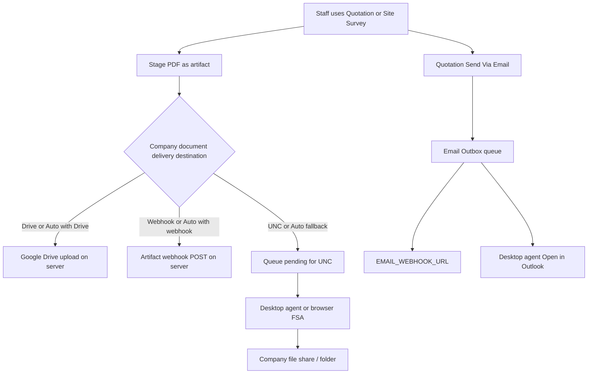

# Sync Center — complete configuration guide

**Route:** `/sync` (sidebar → **Sync Center**)  
**Who can open it:** Business Owners and Staff (same Business Profile / branch)  
**Related UI:** Business Profile → **Company document delivery**  
**Related:** Email Outbox Outlook compose uses the **same desktop agent** — see [`EMAIL_OUTBOX.md`](EMAIL_OUTBOX.md)

---

## Who needs Sync Center?

| Audience | Need Sync Center day-to-day? | Why |
|----------|------------------------------|-----|
| **Most companies (Google Drive or artifact webhook)** | **Rarely** | Owner sets destination on Business Profile once; PDFs deliver automatically. Staff only generate documents. |
| **Company using UNC / file-server path** | **Yes (one PC)** | Pending files wait until a desktop agent or browser folder sync writes them to the share. |
| **Company using Email Outbox → Open in Outlook** | **Yes (Outlook PC)** | Same desktop agent; install once via Sync Center setup zip. |
| **Anyone after a failed Drive/webhook delivery** | **Sometimes** | Open Sync Center to see pending/failed files and click **Retry**. |
| **Staff on Drive-only companies** | **No** | They never connect Drive and normally never open Sync Center. |
| **JustX engineer** | Platform only | Google OAuth client / server `.env` — not per-customer Sync Center. |

**Short answer:** Sync Center is a **status / retry / UNC / Outlook-agent** page. It is **not** required for every customer. Drive/webhook companies configure **Company document delivery** on the profile; Sync Center is optional unless something fails or they use UNC/Outlook.

---

## What does Sync Center sync? (and what it does not)

### Company **files** (artifacts) — Sync Center pending list

These are **PDF/file documents** staged for **Company document delivery** (Business Profile destination):

| Currently wired tools | What gets delivered |
|-----------------------|---------------------|
| **Quotation V1** | Quotation PDF when staff submit / archive to company |
| **Site Survey V1** | Survey PDF when staff deliver/export to company |

Flow: tool → `deliverToolArtifact` → server `artifact_deliveries` row → destination (Drive / artifact webhook / UNC queue).

**All Company document delivery variants:**

| Profile destination | Automatic? | Sync Center role |
|---------------------|------------|------------------|
| **Auto** | Tries Drive → else artifact webhook → else UNC | Status; agent only if it falls through to UNC |
| **Company Google Drive** | Yes (server uploads) | Status / Retry if upload failed |
| **Corporate artifact webhook** | Yes (server POST) | Status / Retry if webhook failed |
| **UNC / file server** | No — queued as **pending** | **Desktop agent** or **browser folder sync** must run |
| **Browser download only (`none`)** | No company folder | Optional local FSA / download only |

Same-filename policy (overwrite / rename / skip) applies to Drive and UNC/browser folder. See Part 1 below.

### Quotation **emails** — Email Outbox (separate queue)

| Email path | Sync Center needed? | What happens |
|------------|---------------------|--------------|
| **A. `EMAIL_WEBHOOK_URL`** | No | Server POSTs email JSON (+ PDF) to your automation |
| **B. Mailto** | No | Browser opens mail app; staff attach PDF manually |
| **C. Open in Outlook** | **Yes** (desktop agent on that PC) | Agent opens Outlook with PDF attached — does **not** copy files to Drive/UNC |

Email outbox PDF attachments are stored as artifacts with **`skipDispatch`** — they are **not** pushed through Company document delivery / Sync Center pending for Drive/UNC. Sending email and filing the company PDF are **two different actions**.

### Explicit non-goals

| Not handled by Sync Center | Where it lives |
|----------------------------|----------------|
| Sending quotation emails | [`EMAIL_OUTBOX.md`](EMAIL_OUTBOX.md) |
| Notifications inbox | Notifications UI |
| Choosing Drive vs webhook vs UNC | **Business Profile → Company document delivery** (Owner) |
| Platform Google OAuth client | JustX `server/.env` |

**Badges:** Sync Center counts **pending files**. Email Outbox counts **pending/failed emails**. Do not mix them.

---

## How it works (end-to-end)



1. **Owner** sets destination on Business Profile (once per company/branch).  
2. **Staff** generate a PDF in a tool (Quotation / Site Survey).  
3. Server stages an artifact and **dispatches** immediately for Drive/webhook, or **queues pending** for UNC.  
4. **Sync Center** shows company delivery status, pending UNC files, retries, and desktop-agent connection.  
5. Separately, **Send Via → Email** creates an Email Outbox row (webhook / mailto / Outlook agent).

Desktop agent (optional): one install per Windows user/PC via Sync Center **Download setup for this PC**. Same agent serves UNC file sync **and** Outlook compose.

---

Sync Center is the **status / retry / optional UNC sync** page. Most companies only need Owner setup on **Business Profile**; staff then generate PDFs and files land automatically (Drive/webhook). Use Sync Center when:

- Delivery failed and you need retries  
- Destination is a Windows **UNC / file share** (desktop agent)  
- You want to sync via **this browser** (Chrome/Edge File System Access)  
- You need a desktop agent for **Email Outbox → Open in Outlook**

---

## Configuration map (where everything lives)

| Setting | Where to configure | Who | Stored in |
|---------|-------------------|-----|-----------|
| Destination mode (`auto` / Drive / webhook / UNC / none) | **Business Profile** → Company document delivery | Owner | MySQL profile |
| Company Google Drive OAuth + folder | Same panel → Connect / Save folder | Owner | Encrypted on profile |
| Artifact webhook URL + secret | Same panel — **how to get:** [§1.3](#13-corporate-artifact-webhook-sharepoint--onedrive--power-automate) | Owner | Profile |
| Download Folder UNC path | Same panel → Show UNC options — **how to get:** [§1.4](#14-company-file-server--download-folder-path-unc--optional) | Owner | Profile |
| Same-filename / conflict policy | Same panel | Owner | Profile |
| Desktop agent setup | **Sync Center** → Download setup for this PC | Owner or Staff | LocalAppData + agent row |
| Browser-linked folder (FSA) | Sync Center → Link folder in this browser | Staff (Chrome/Edge) | Browser IndexedDB (this browser only) |
| Platform Google OAuth client | **Admin → Integrations** (preferred) or VPS `server/.env` (`GOOGLE_CLIENT_*`) | JustX engineer / platform admin | Admin DB or server env |

Nothing below is configured in `EMAIL_WEBHOOK_URL` — that env var is for **quotation emails**, not PDF file delivery. (Profile **artifact** webhook is separate.)

---

## Step 0 — Prerequisites

1. Sign in at https://justxsystems.com/jbt (or local).  
2. Select the correct **branch / Business Profile** (Branch switcher).  
3. Owner must have an active Business Profile saved.  
4. For **Company Google Drive** only: platform admin enables Google under **Admin → Integrations** (or `GOOGLE_CLIENT_ID` / `SECRET` in `.env`). Not required for webhook/UNC/email-only companies (see [`SETUP.md`](SETUP.md)#is-google-cloud-oauth-mandatory).

### Customer PC — minimum software & environment (desktop agent)

**Primary setup (recommended for staff):** Sync Center → **Download setup for this PC** → extract → double-click **Install JustX Sync Agent.cmd**. No separate Node.js or PowerShell skills required (portable Node is inside the zip).

| Requirement | UNC / file sync | Outlook compose | Notes |
|-------------|-----------------|-----------------|--------|
| **Windows 10 or 11** | Required | Required | Agent and Outlook COM are Windows-only |
| **Outbound HTTPS** to JustX API | Required | Required | Same host as the web app API |
| **Setup zip from Sync Center** | Required | Required | Personalized zip includes token + portable Node |
| **Write access to Download Folder** | If syncing files | Not required | UNC/share ACL, mapped drive, and/or VPN as needed |
| **Desktop Microsoft Outlook** | Not required | Required | Classic Outlook with COM — not Outlook on the web alone |
| **Chrome or Edge on the same PC** | Recommended | Recommended | Browser must reach local bridge `http://127.0.0.1:17865` |
| **Node.js / PowerShell skills** | Not required | Not required | Included / used only behind the scenes |
| **Git repo / developer tools** | Not required | Not required | Advanced IT path only |

**Not required:** admin rights for normal per-user install, npm packages, Java, .NET SDK, or `EMAIL_WEBHOOK_URL` (cloud email Path A only).

**Also required (process):**

- Signed in as **Owner or Staff** on the correct Business Profile  
- For file sync: Owner has set **Download Folder** (or use Drive/webhook and skip the agent)  
- Local port **17865** free; Windows user logged on for auto-start  
- Browser and agent on the **same** PC  

**Operational caveats:**

| Topic | Detail |
|-------|--------|
| **Per Windows user** | Install is per logged-on user (`%LOCALAPPDATA%`) |
| **Classic Outlook** | Path C needs desktop Outlook COM |
| **Corporate lockdown** | If Scheduled Task is blocked, Install adds a Startup shortcut fallback |
| **Token privacy** | Setup zip + `config.json` contain `jxsa_…` — treat like a password |
| **Pack missing on server** | Web deploy must run `pack-agent-artifacts`. Win-x64 zip (~28MB) is **skipped** unless `pack_win_agent=true` (CI) or `JBT_SKIP_WIN_AGENT_PACK` unset locally. If Sync Center setup fails with pack 404, or agent version stays old after “redeploy”, enable win pack — [Confirm desktop agent version](#confirm-desktop-agent-version-in-build--on-pc) |
| **Drive / webhook only** | No agent required for PDFs when destination is Drive/webhook |

**Verify:** after Install, Sync Center shows Connected, **and** Sync now clears Pending (see [Connected ≠ sync OK](#connected--sync-ok) below). Or run **Check Status.cmd**.

**Advanced:** PowerShell launcher / slim `desktop-sync-agent.zip` still available under Sync Center → Advanced.

---

## Part 1 — Owner: Company document delivery (required for automatic PDFs)

**Where:** Sidebar → **Business Profile** → panel **Company document delivery**  
**Save:** Use the profile **Save** button after changing destination / UNC / webhook fields. Drive folder has its own **Save company folder** button.

### 1.1 Choose destination

| Value in UI | Meaning | Typical when |
|-------------|---------|--------------|
| **Auto** (recommended) | Try company Drive → else profile webhook → else UNC queue | Default for most companies |
| **Company Google Drive** | Only Drive | Drive is the sole destination |
| **Corporate webhook** | POST each file to your SharePoint / Power Automate URL | IT already has an intake flow |
| **Company file server (UNC)** | Queue for desktop agent / browser sync to a path | On-prem share only |
| **Browser download only** | No company folder automation | Temporary / demos |

### 1.2 Google Drive (most common)

1. Destination = **Auto** or **Company Google Drive**.  
2. Click **Connect company Google Drive**.  
3. Sign in with the **company** Google / Workspace account (not personal if avoidable).  
4. Paste shared folder link (or folder ID) → optional label → **Save company folder**.  
5. Set **Same-filename policy**:

| Policy | Effect |
|--------|--------|
| **Overwrite** (recommended) | Same name → new Drive revision, same link |
| **Rename** | Keeps old file; writes `name (1).ext` |
| **Skip** | Leaves existing file unchanged |

6. Click profile **Save** if you also changed destination dropdown.  
7. Generate a test quotation PDF → confirm it appears in the company Drive folder.  
8. Sync Center should show **Company automatic delivery** ready.

**Staff:** do nothing on Drive. They only use JustX tools.

**Troubleshoot:**

| Symptom | Fix |
|---------|-----|
| Connect button missing / OAuth error | Platform `GOOGLE_CLIENT_*` + redirect URI (see [`SETUP.md`](SETUP.md)) |
| Connected but no uploads | Folder not saved; reconnect; destination not Auto/Drive |
| Wrong company files | Wrong Business Profile selected in branch switcher |

### 1.3 Corporate artifact webhook (SharePoint / OneDrive / Power Automate)

**Different from** `EMAIL_WEBHOOK_URL` (emails). This is **per Business Profile** for **PDF/files**.

JustX does **not** generate the Webhook URL. You create an HTTPS inbound webhook in Microsoft Power Automate (or n8n/Make), then paste that URL into Business Profile.

#### What each field means

| Field in Business Profile | What it is | How you get it |
|---------------------------|------------|----------------|
| **Webhook URL** | Public `https://…` endpoint that accepts JustX’s JSON POST when a PDF is ready | Created in Power Automate / Logic Apps / n8n / Make (steps below) |
| **Webhook secret (optional)** | A password **you invent** (not from Microsoft). If set, JustX sends header `X-JustX-Signature: sha256=…` so your flow can verify the body | Type any long random string (e.g. password manager). Leave blank to skip signing. Leave blank later to **keep** a saved secret. |

#### Recommended: SharePoint or OneDrive via Power Automate

Use this when the company wants files in **SharePoint document library** or **OneDrive for Business**, without Google Drive.

**Step A — Create the flow (company Microsoft 365 admin / Owner with flow rights)**

1. Open [Power Automate](https://make.powerautomate.com) signed in with the **company** work account.  
2. **Create** → **Automated cloud flow** (or Instant → skip trigger and add “When an HTTP request is received”).  
3. Trigger: **When an HTTP request is received**.  
4. After you **save** the flow once, open the trigger again and copy **HTTP POST URL**  
   - Looks like: `https://prod-xx.westus.logic.azure.com:443/workflows/…/triggers/manual/paths/invoke?api-version=…&sp=…&sv=…&sig=…`  
   - That full URL **is** your **Webhook URL** for JustX.  
5. Optional: in the trigger, paste a sample JSON schema (Request Body JSON Schema) so dynamic content is easier:

```json
{
  "type": "object",
  "properties": {
    "event": { "type": "string" },
    "artifactId": { "type": "string" },
    "toolId": { "type": "string" },
    "filename": { "type": "string" },
    "mimeType": { "type": "string" },
    "contentBase64": { "type": "string" },
    "contentHash": { "type": "string" },
    "byteSize": { "type": "number" },
    "timestamp": { "type": "string" }
  }
}
```

6. Add action **Create file** (OneDrive for Business) **or** **Create file** (SharePoint):  
   - **Folder path / Site Address + Folder Path:** pick the company library folder (e.g. `/Shared Documents/JustX` or `/Quotations`).  
   - **File name:** use dynamic content `filename` from the trigger.  
   - **File content:** use expression to decode base64, e.g.  
     `base64ToBinary(triggerBody()?['contentBase64'])`  
7. **Save** the flow and turn it **On**.  
8. Copy the **HTTP POST URL** again if it changed after save.

**Step B — Paste into JustX (Owner)**

1. Business Profile → **Company document delivery**.  
2. Destination = **Corporate webhook** (or **Auto** if Drive is not connected).  
3. **Webhook URL** = the Power Automate HTTP POST URL from Step A.  
4. **Webhook secret (optional):** invent a long secret; store the same value in your flow if you add a condition on `X-JustX-Signature`. Or leave blank.  
5. Profile **Save**.  
6. Generate a test Quotation/Site Survey PDF → confirm the file appears in SharePoint/OneDrive.  
7. Sync Center → Company automatic delivery should look ready; pending should clear for webhook successes.

#### What JustX POSTs (artifact webhook)

```http
POST <Webhook URL>
Content-Type: application/json
X-JustX-Event: artifact.ready
X-JustX-Artifact-Id: art_…
X-JustX-Signature: sha256=<hex>   # only if secret is set
```

Body (JSON) includes at least: `event`, `artifactId`, `toolId`, `filename`, `mimeType`, `byteSize`, `contentHash`, `contentBase64`, `timestamp`, plus org/profile/user ids.

#### Alternatives to Power Automate

| Tool | How to get Webhook URL |
|------|-------------------------|
| **n8n** | Workflow → Webhook node → Production URL |
| **Make.com** | Webhooks → Custom webhook → copy URL |
| **Azure Logic Apps** | Same pattern as Power Automate (“When a HTTP request is received”) |
| **Your API** | Any HTTPS endpoint that accepts the JSON above and stores the file |

**Not valid as Webhook URL:** SharePoint site URL, OneDrive folder link, Graph API key alone, or email address. Those are destinations *inside* the automation — JustX only needs the **inbound HTTPS webhook**.

#### Webhook secret — detail

- Optional. Improves authenticity if the URL leaks.  
- You **choose** the string; Microsoft does not give it to you.  
- If set, verify: HMAC-SHA256 of the **raw JSON body** with your secret; compare to header value after `sha256=`.  
- If you leave the field blank on a later Save, JustX **keeps** the previously stored secret.

---

### 1.4 Company file server / Download Folder path (UNC — optional)

Use this when files should land on a **Windows path** the office PC can write (on-prem file server, mapped drive, or a folder synced by the **OneDrive/SharePoint sync client**).

#### What each field means

| Field | What it is | How you get it |
|-------|------------|----------------|
| **Company file server (optional)** | UI section under **Show UNC / file-server options** | Click that button on Business Profile → Company document delivery |
| **Download Folder path** | Absolute Windows or UNC path where the **desktop agent** (or browser folder sync) writes PDFs | From File Explorer address bar on a PC that can see the folder (examples below) |
| **Conflict policy** | overwrite / rename / skip when the same filename exists | Owner chooses in the same panel |

JustX does **not** invent this path. The Owner (or IT) decides the folder and pastes the path.

#### Path examples

```text
\\fileserver\shared\JustX-Artifacts
\\fileserver\departments\Sales\Quotations
D:\CompanyShare\JustX
Z:\JustX
```

**OneDrive (sync client on a Windows PC):**

1. In File Explorer, open the synced OneDrive / “OneDrive - Contoso” folder.  
2. Create e.g. `JustX-Artifacts`.  
3. Click the address bar → copy the full path, e.g.  
   `C:\Users\alex\OneDrive - Contoso\JustX-Artifacts`  
4. Paste that as **Download Folder path**.  
5. Install the Sync Center desktop agent **on a PC that keeps that OneDrive folder signed in and syncing** (often a always-on office PC).

**SharePoint library via sync client:**

1. Open the SharePoint document library in the browser → **Sync** (OneDrive sync).  
2. After sync, open the local folder in Explorer (e.g. `C:\Users\alex\Contoso\Sales - Documents\JustX`).  
3. Copy that path into **Download Folder path**.  
4. Same rule: desktop agent must run on a machine where that sync folder is available and writable.

**Pure cloud SharePoint/OneDrive without a sync PC:** prefer **§1.3 Corporate webhook** (Power Automate Create file) instead of UNC. A UNC/local path cannot reach SharePoint online by itself.

#### Setup steps (Owner + one PC)

1. Create the target folder in File Explorer (example: `C:\JustX\Artifacts`).  
2. Click the address bar → copy the **full absolute path**.  
3. Business Profile → Company document delivery → destination **Company file server (UNC)** or **Auto** (with Download Folder set as fallback).  
4. **Show UNC / file-server options**.  
5. Paste **Download Folder path** (e.g. `C:\JustX\Artifacts` or `\\fileserver\shared\JustX`).  
6. Conflict policy → usually **Overwrite**.  
7. Profile **Save**.  
8. Sync Center → confirm **Download Folder** shows that path.  
9. Sync Center → **Download setup for this PC** → Install on a machine that can write that path (VPN/share ACL / OneDrive signed in).  
10. Sync Center → **Desktop agent: Connected** → **Sync now (desktop agent)** (or wait for poll).  
11. Test PDF → Pending should clear; file appears in the folder (and syncs to cloud if using OneDrive/SharePoint sync).

If destination is UNC and path is empty, Sync Center warns you to set the path.

**Local folder is fully supported** — it does not have to be a UNC share. Any absolute Windows path this PC can write works (`C:\…`, `D:\…`, OneDrive sync path, or `\\server\share\…`).

#### Choosing webhook vs Download Folder for Microsoft 365

| Goal | Prefer |
|------|--------|
| Files appear in SharePoint/OneDrive with **no always-on office PC** | **Webhook URL** + Power Automate (§1.3) |
| Files land on a **local/UNC share** or synced folder on a known PC | **Download Folder path** + desktop agent (§1.4) |
| Google Workspace | **Company Google Drive** (§1.2), not these fields |

---

## Part 2 — Sync Center page (status & manual sync)

**Where:** Sidebar → **Sync Center** (`/sync`)

### 2.1 What each panel means

| Panel | Meaning |
|-------|---------|
| **Company automatic delivery** | Effective destination + whether automation is ready; link back to Profile |
| **Pending** | Artifacts waiting for folder sync (UNC / FSA / agent) — **not** Email Outbox count |
| **Download Folder** | UNC/absolute path from Profile |
| **This browser** | File System Access link status (Chrome/Edge) |
| **Desktop agent** | Whether `http://127.0.0.1:17865` responds on **this PC** |
| **Sync now (desktop agent)** | Triggers one sync pass via local agent |
| **Sync now (this browser)** | Writes pending files into the linked FSA folder |
| **Link folder in this browser** | Pick a local/network folder (persists in this browser) |
| **Connect desktop agent** | Create `JBT_AGENT_TOKEN` + launcher |
| **Registered agents** | List / revoke tokens for this profile |
| **Pending files** | Queue list + Retry for failed/conflict |

### 2.2 Browser sync (no agent)

1. Chrome or Edge on a PC that can see the target folder.  
2. **Link folder in this browser** → pick folder (can be mapped drive).  
3. **Sync now (this browser)** when Pending &gt; 0.  
4. Re-link if you clear site data or switch browser/profile.

**Limits:** Not available in all browsers; permission is per-browser; UNC may need the share mapped/accessible to that Windows user.

### 2.3 Desktop agent sync (UNC / Outlook)

#### Generate token (UI) + install (recommended)

1. Sync Center → **Set up on this PC**.  
2. Optional **PC label**.  
3. Click **Download setup for this PC** → saves `JustX-Sync-Agent-Setup.zip`.  
4. Extract the zip on the Windows PC.  
5. Double-click **Install JustX Sync Agent.cmd** → wait for SUCCESS.  
6. Return to Sync Center → **Desktop agent: Connected** → **Sync now** if Pending &gt; 0.  
7. Confirm Pending drops and files land in the Download Folder (Connected alone is not enough — see below).

Uninstall: run **Uninstall JustX Sync Agent.cmd**. Status: **Check Status.cmd**.

**Advanced (IT / PowerShell):** Sync Center → Advanced → Download PowerShell launcher, or use `desktop-sync-agent\install-agent.ps1`. See `desktop-sync-agent/README.md`.

#### Connected ≠ sync OK

| UI / probe | Means | Does **not** mean |
|------------|--------|-------------------|
| **Desktop agent: Connected** (`http://127.0.0.1:17865`) | Local bridge is up on **this** PC | API auth, folder write, or Pending clearing |
| **Sync now** succeeds | Agent fetched pending items and wrote files | — |
| Pending stays &gt; 0 | Sync failed or never reached the real API | Agent is “broken” solely because of the folder path |

**Production `JBT_API_BASE` must include `/jbt`:**

| Environment | Correct `apiBase` / `JBT_API_BASE` | Wrong |
|-------------|-------------------------------------|--------|
| Production | `https://justxsystems.com/jbt/api` | `https://justxsystems.com/api` (hits marketing site HTML) |
| Local dev | `http://localhost:4000/api` | — |

Install writes `%LOCALAPPDATA%\JustX\sync-agent\config.json`. After Install, verify:

```powershell
# Bridge + last sync result
Invoke-RestMethod http://127.0.0.1:17865/status | ConvertTo-Json -Depth 5

# Config (do not share agentToken)
Get-Content "$env:LOCALAPPDATA\JustX\sync-agent\config.json"
Get-Content "$env:LOCALAPPDATA\JustX\sync-agent\agent.log" -Tail 40
```

`status.apiBase` must be the **correct** URL above. If sync fails, `lastError` / `lastResult.message` / `agent.log` show the real reason (wrong API base, folder inaccessible, auth error).

**Immediate workaround if agent API sync fails:** Sync Center → **Link folder in this browser** → pick the same folder → **Sync now (this browser)** (uses your login session, not the agent token).

#### Confirm desktop agent version (in build + on PC)

Outlook Corporate HTML and several bridge fixes require a **minimum agent app version** (today **≥ 1.1.3**). Source of truth: `desktop-sync-agent/src/index.js` → `export const AGENT_VERSION`.

| Check | How |
|-------|-----|
| On PC after Install | `Invoke-RestMethod http://127.0.0.1:17865/health` → `version` |
| Inside built zip | `JustX-Sync-Agent/PACK_VERSION.txt` and `app/src/index.js` (`AGENT_VERSION`) |
| In CI | Deploy with **`pack_win_agent=true`**; **Build web** log prints `AGENT_VERSION` / pack version from the zip |

**Critical:** Deploy **auto-rebuilds** `JustX-Sync-Agent-win-x64.zip` when agent-related paths change (see [`DEPLOY.md`](DEPLOY.md)#auto-pack-windows-sync-agent). Unrelated pushes skip the pack and the VPS **keeps the previous zip**. Reinstalling from Sync Center then reinstalls whatever is on the VPS. Force with workflow input **`pack_win_agent` = true** if needed. Confirm **Decide win agent pack** / Build web logs show `PACK_WIN_AGENT=true` and the packed `AGENT_VERSION`.

**Not the app version:** GitHub’s “Node 20 is being deprecated” on Actions, or cache key `agent-node-win-*-v20.18.1` — that is the **portable Node runtime** pinned inside the customer zip / CI cache, separate from `AGENT_VERSION`.

Canonical detail for Email Path C: [`EMAIL_OUTBOX.md`](EMAIL_OUTBOX.md)#confirm-agent-version--113-path-c--html · Deploy input: [`DEPLOY.md`](DEPLOY.md)#advanced-cd--workflow_dispatch-options.

#### Manual env (instead of `.ps1`)

```powershell
cd desktop-sync-agent
npm install   # once
$env:JBT_API_BASE = "https://justxsystems.com/jbt/api"   # must include /jbt in production
$env:JBT_AGENT_TOKEN = "jxsa_PASTE_FROM_SYNC_CENTER"
$env:JBT_DOWNLOAD_FOLDER = "C:\JustX\Artifacts"   # optional override of Profile path
$env:JBT_POLL_MS = "15000"      # 0 = only sync when UI clicks
$env:JBT_BRIDGE_PORT = "17865"
npm start
```

| Env | Required? | Where from |
|-----|-----------|------------|
| `JBT_API_BASE` | Yes | **Production:** `https://justxsystems.com/jbt/api`. **Local:** `http://localhost:4000/api`. Launcher / setup zip should set this from the browser (`/jbt` base path included). |
| `JBT_AGENT_TOKEN` | Yes | **Only** Sync Center → Create token / Download setup |
| `JBT_DOWNLOAD_FOLDER` | No | Overrides Profile Download Folder for this PC |
| `JBT_POLL_MS` | No | Background poll; default `15000`; `0` = UI-triggered only |
| `JBT_BRIDGE_PORT` | No | Default `17865` |
| `JBT_BRIDGE_ORIGIN` | No | CORS for bridge; default `*` |

#### Revoke

Sync Center → Registered agents → **Revoke**. Old launcher / LocalAppData config stop working; create a new token and re-run `-Install`.

#### Same agent for Email Outbox

With agent running on Windows + **classic** Outlook (COM) installed: **Email Outbox → Open in Outlook** / **Open HTML in Outlook**. No separate token. Use Install so the agent is up after reboot.

**Before Open in Outlook:** finish Outlook **Add Account**, turn off New Outlook, confirm COM — full steps in [`EMAIL_OUTBOX.md`](EMAIL_OUTBOX.md)#prep-classic-outlook-on-windows-paths-b--c. Mailto body with literal `+` / `%0A`: [`EMAIL_OUTBOX.md`](EMAIL_OUTBOX.md)#mailto-encoding-spaces-as--and-0a. Corporate HTML needs agent **≥ 1.1.3** and a deploy that ran **`pack_win_agent=true`** — [`EMAIL_OUTBOX.md`](EMAIL_OUTBOX.md)#confirm-agent-version--113-path-c--html · [engineer ship order](EMAIL_OUTBOX.md#engineer-ship-order-path-c-html-fix--customers).

---

## Part 3 — End-to-end checklists

### Drive-only company (recommended)

- [ ] Owner: Profile → Connect Drive → Save folder → Overwrite policy → Save  
- [ ] Test PDF appears in Drive  
- [ ] Staff never open Sync Center for normal work  
- [ ] Sync Center used only if something is pending/failed  

### UNC / local folder company

- [ ] Owner: Destination **UNC** (or Auto) → paste absolute **Download Folder path** (e.g. `C:\JustX\Artifacts`) → Save  
- [ ] Sync Center shows that Download Folder path  
- [ ] Staff or Owner: Sync Center → Download setup → Install on a PC that can write the folder  
- [ ] Sync Center: **Connected** + `status.apiBase` is `…/jbt/api` in production  
- [ ] **Sync now (desktop agent)** (or wait for poll) → Pending → 0; files in folder  
- [ ] Fallback: **Link folder in this browser** + **Sync now (this browser)**  

### Artifact webhook company

- [ ] Owner: set destination + webhook URL (+ secret) → Save  
- [ ] Confirm automation receives posts  
- [ ] Sync Center for failures / status  

---

## Troubleshooting

| Symptom | Check |
|---------|--------|
| **Connected but Pending never drops / Sync now no-op** | Open `http://127.0.0.1:17865/status` — inspect `apiBase`, `lastError`, `lastResult`. Read `%LOCALAPPDATA%\JustX\sync-agent\agent.log` |
| **`apiBase` is `https://justxsystems.com/api` (no `/jbt`)** | Wrong — must be `https://justxsystems.com/jbt/api`. Fix `config.json`, restart agent (or re-download setup after a web build that includes base-path fix). Wrong URL returns HTML and sync reports “No Download Folder…” falsely |
| **`No Download Folder configured…` in log/status** | Often wrong `apiBase` (above). Else Owner must Save Download Folder on Profile; Sync Center must show the path |
| **`No access to this business branch` (403)** | Agent token rejected by API branch ACL — deploy API fix that marks agent auth (`viaAgentToken`); or use **Sync now (this browser)** until deployed. Re-download setup only after API is fixed if token/profile mismatch suspected |
| Pending never drops (other) | Destination UNC without agent/FSA; Drive not connected; webhook failing |
| Agent “Not detected” | Agent not running on **this** PC; wrong machine; run Check Status.cmd |
| Setup download fails / no file saved | Look for red error under the button (often version mismatch or missing zip). Zip must exist at `/jbt/JustX-Sync-Agent-win-x64.zip`. Redeploy with agent auto-pack / `pack_win_agent`. Browser may block popups — allow downloads. |
| Agent reinstalled but `/health` version old | Win pack was skipped on deploy — VPS zip stale. Redeploy with **`pack_win_agent=true`**, then Download setup again — [Confirm version](#confirm-desktop-agent-version-in-build--on-pc) |
| Agent pack download fails | Slim `desktop-sync-agent.zip` 404 — same redeploy |
| Folder not reachable | Path wrong; PC not on VPN; agent user lacks share ACL; create folder first |
| Badge / pending confusion | Sync Center pending = **files**; Email Outbox badge = **emails** |
| Token lost | Download setup again (new token); revoke old agent |
| Staff can’t edit path | Only Owner edits Profile delivery settings |
| Open in Outlook fails while Connected | Same API/`apiBase`/auth issues as file sync; classic desktop Outlook required; agent **≥ 1.1.3** for Corporate HTML; COM hang / Add Account / New Outlook — [`EMAIL_OUTBOX.md`](EMAIL_OUTBOX.md)#troubleshooting |

---

## Related docs

- [`SETUP.md`](SETUP.md) — platform env, client Drive Part B  
- [`EMAIL_OUTBOX.md`](EMAIL_OUTBOX.md) — quotation email paths + Outlook · [agent ≥ 1.1.3](EMAIL_OUTBOX.md#confirm-agent-version--113-path-c--html)  
- [`DEPLOY.md`](DEPLOY.md) — `pack_win_agent` to ship a new win agent zip  
- [`DOWNLOAD_FOLDER.md`](DOWNLOAD_FOLDER.md) — short model + conflict policy  
- `desktop-sync-agent/README.md` — bridge API · pack version  
